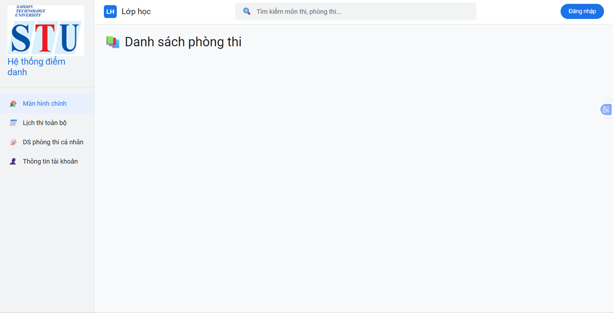
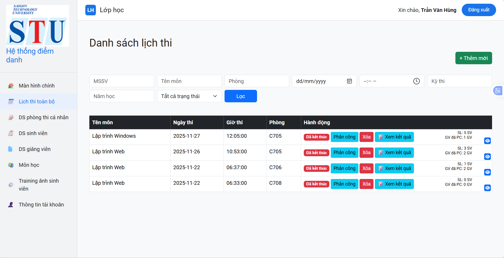
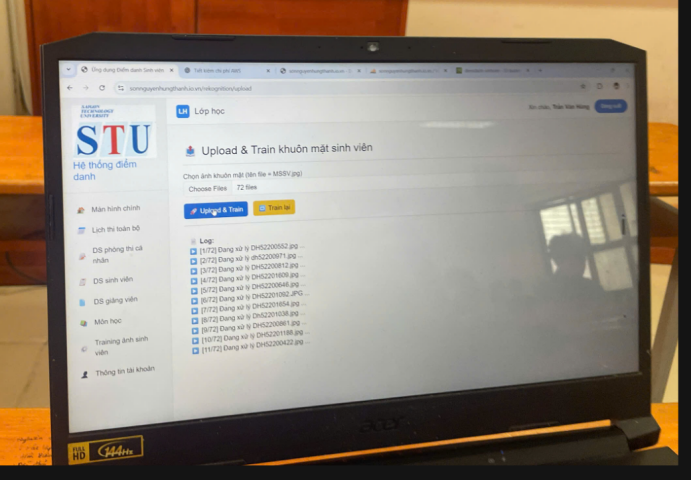
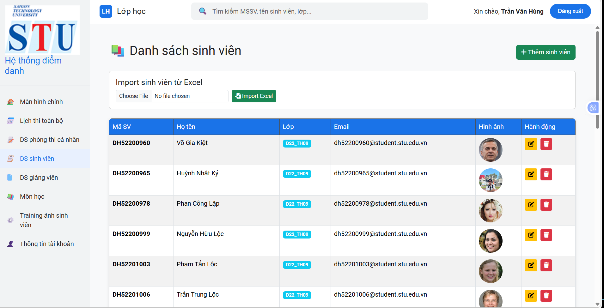
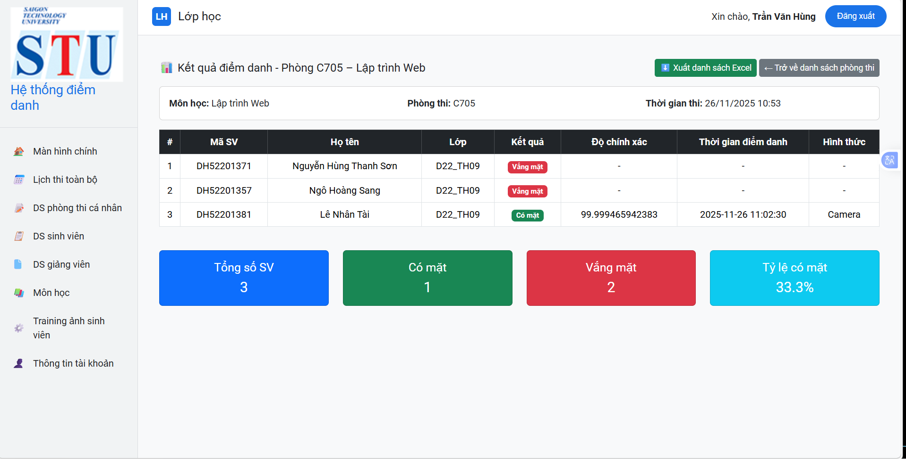

# Face Recognition Attendance System

Hệ thống điểm danh sinh viên bằng nhận diện khuôn mặt sử dụng Laravel và AWS Rekognition.

## Giới thiệu

Đây là hệ thống điểm danh sinh viên bằng công nghệ nhận diện khuôn mặt.

Hệ thống cho phép:
- Quản lý sinh viên
- Quản lý giảng viên
- Quản lý lịch thi
- Phân công gác thi
- Train khuôn mặt sinh viên
- Điểm danh bằng hình ảnh
- Lưu lịch sử điểm danh

## Công nghệ sử dụng

- PHP
- Laravel
- MySQL
- Bootstrap
- AWS S3
- AWS Rekognition
- AWS SDK for PHP

## Kiến trúc hệ thống

1. Ảnh sinh viên được upload lên hệ thống
2. Ảnh được lưu trữ trên AWS S3
3. AWS Rekognition sử dụng IndexFaces để lưu vector khuôn mặt
4. Khi điểm danh, ảnh mới được gửi lên Rekognition
5. Rekognition sử dụng SearchFacesByImage để so khớp khuôn mặt
6. Kết quả được lưu vào database

## Chức năng chính

### Admin
- Quản lý sinh viên
- Train khuôn mặt sinh viên
- Quản lý phòng thi
- Phân công giám thi gác thi
- Xem lịch sử điểm danh

### Giảng viên
- Điểm danh cho sinh viên bằng nhận diện khuôn mặt

## Demo

Website:  
https://sonnguyenhungthanh.io.vn

Tài khoản demo:

Admin  
email: test@gmail.com  
password: 123123

Giảng viên
email: bb@gmail.com
password: 111111

## Hình ảnh hệ thống

### Trang chủ

### Dashboard Admin

### TrainImages

### Quản lý sinh viên

### Kết quả điểm danh

## Cài đặt project

Clone project

git clone https://github.com/Thanhson10/diemdanh-hinhanh.git

Cài đặt thư viện

composer install

Tạo file môi trường

cp .env.example .env

Mở file .env và cấu hình:

DB_DATABASE=name_database

DB_USERNAME=root

DB_PASSWORD=

AWS_ACCESS_KEY_ID=your_access_key

AWS_SECRET_ACCESS_KEY=your_secret_key

AWS_DEFAULT_REGION=ap-southeast-1

AWS_BUCKET=your_bucket_name

AWS_COLLECTION_ID=your_collection_id

Generate key

php artisan key:generate

Setup database

php artisan migrate

Chạy project

php artisan serve

## Environment Variables

The following environment variables are required:

- AWS_ACCESS_KEY_ID
- AWS_SECRET_ACCESS_KEY
- AWS_DEFAULT_REGION
- AWS_BUCKET
- AWS_COLLECTION_ID

## Tác giả

Nguyễn Hùng Thanh Sơn

Sinh viên ngành Công nghệ Thông tin